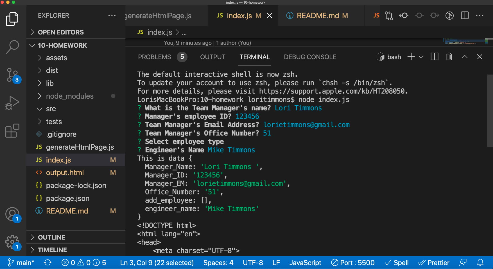
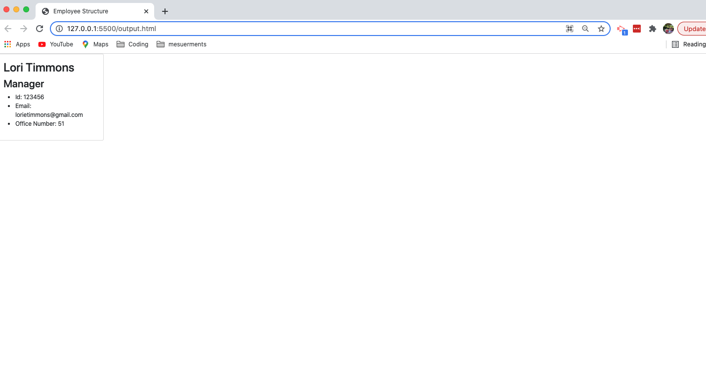

# 10-homework - Lori Timmons 
## Description 
This project is a command-line application that takes employee information input and generates an employee summery to HTML. To use this application,navigate to the command-line and run a node index.js. This will run though a list of questions and options for users to input employees. 

This project was created to help employers gain a complete picture of their team members. 

## Installation 
To create this you need to work in the nodes modules and require the inquirer package and jest package. Please use the below steps to set up your project.
* Create a .gitignore file to store your node_modules
* run an npm init
* install your npm dependencies (package.json)
* Require inquire
* Require @jest/core
* Add node_modules to your .gitignore 

## Usage
This application was created to give an employer a one stop shop to view teams members. 
<!-- Demonstration Video: [Watch the Demo](https://watch.screencastify.com/v/2Vcnc44jwvjJCS1W2rbg) -->

## Test
Coming soon

## Questions 
Contact me @: Lorietimmons@gmail.com 
GitHub Profile: LoriTimmons  
GitHub Repo Link: https://github.com/LoriTimmons/10-homework